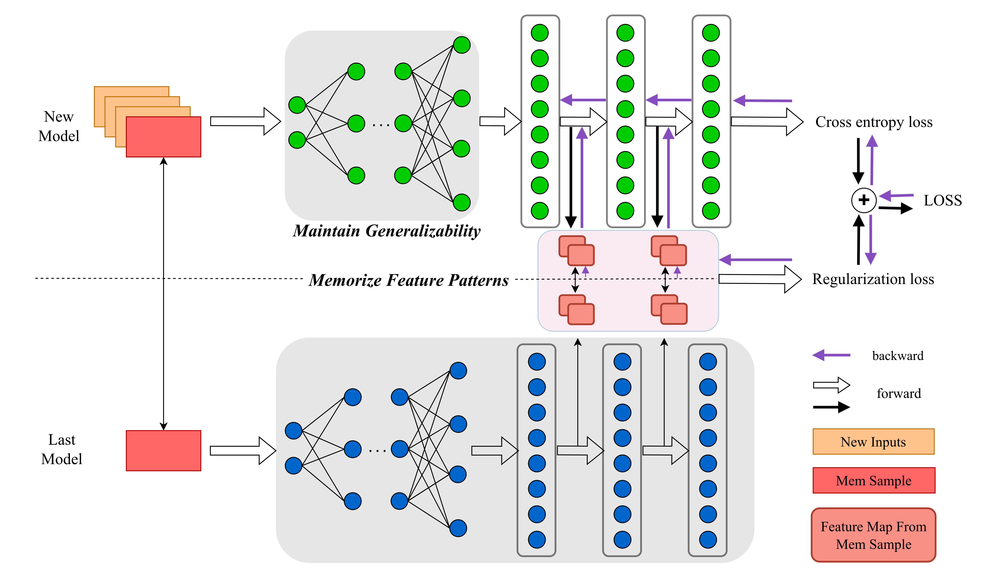
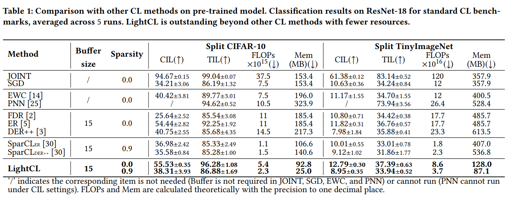

# LightCL

## 1 Introduction

**LightCL** is a compact algorithm for continual learning. Specifically, we consider two factors of generalizability, learning plasticity and memory stability, and design metrics of both to quantitatively assess generalizability of neural networks during CL. This evaluation shows that generalizability of different layers in a neural network exhibits a significant variation. Thus, as shown in the following figure, we **Maintain Generalizability** by freezing generalized parts without the resource-intensive training process and **Memorize Feature Patterns** by stabilizing feature extracting of previous tasks to enhance generalizability for less-generalized parts with a little extra memory, which is far less than the reduction by freezing. The following Experiment illustrate that LightCL outperforms other state-of-the-art methods and reduces at most 6.16× memory footprint. We also verify the effectiveness of LightCL on the edge device.


## 2 Implementation
### Requirements
- Python==3.11.4
- numpy==1.24.3
- torch==2.1.2
- torchvision==0.16.2
- tqdm==4.65.0, etc(which can be easily installed with pip)

### Usage

Run `LightCL.py` with the commands like below:
- Default
```
python LightCL.py 
```
- With sparse
```
python LightCL.py --Sparse
```

Here the major parameters are:
- `lr`: learning rate (default=0.01)
- `Beta`: hyperparameter for regulation loss (default=0.0002)
- `BufferNum`: number of Memory Buffer (default=15)
- `Ratio`: selecting vital feature map with `Ratio` (default=0.15)
- `Seed`: the random seed (default=0)
- `pretrain`: whether use the pre-trained model (default=True)
- `Dataset`: dataset (default: CIFAR10; Other: TinyImageNet)
- `Sparse`: whether sparse (default=False)

Note that we already have the pre-trained model (`ResNet18_for_LightCL.pth`) in the directory. If you want to pre-train the model yourself, you can download dataset `ImageNet32x32` under `data/` and run code `get_parameter.py`.

## 3 Cite
```
@misc{wang2024efficientcontinuallearninglow,
      title={Efficient Continual Learning with Low Memory Footprint For Edge Device}, 
      author={Zeqing Wang and Fei Cheng and Kangye Ji and Bohu Huang},
      year={2024},
      eprint={2407.10545},
      archivePrefix={arXiv},
      primaryClass={cs.LG},
      url={https://arxiv.org/abs/2407.10545}, 
}
```